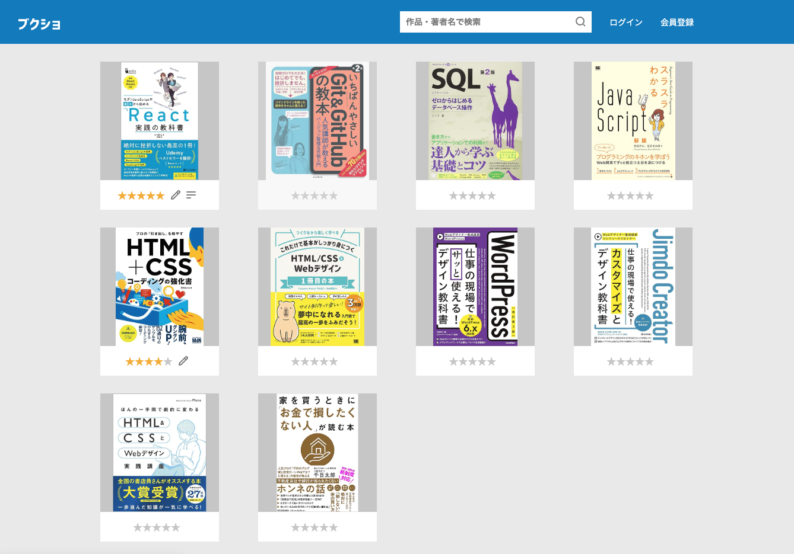
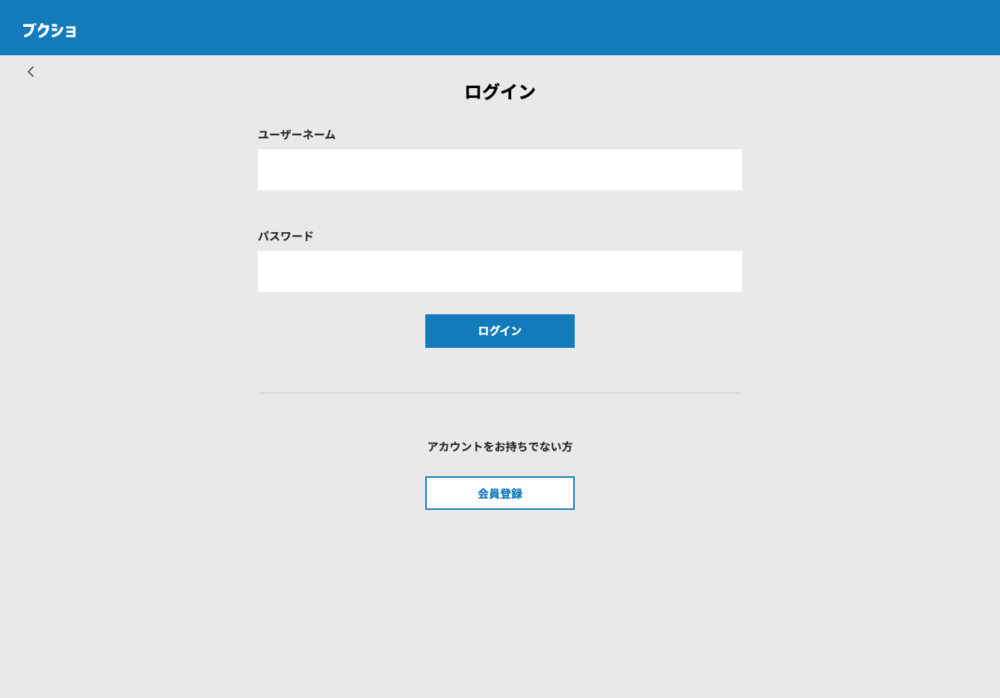
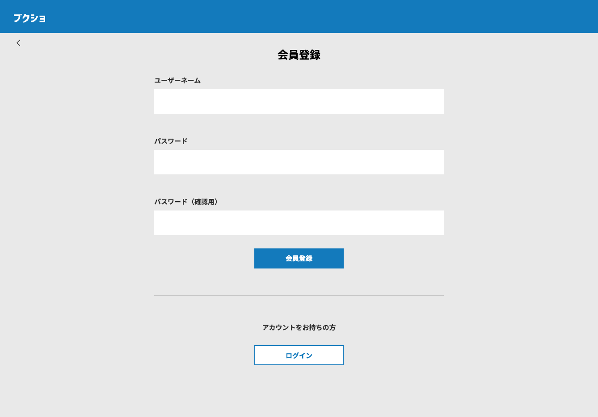
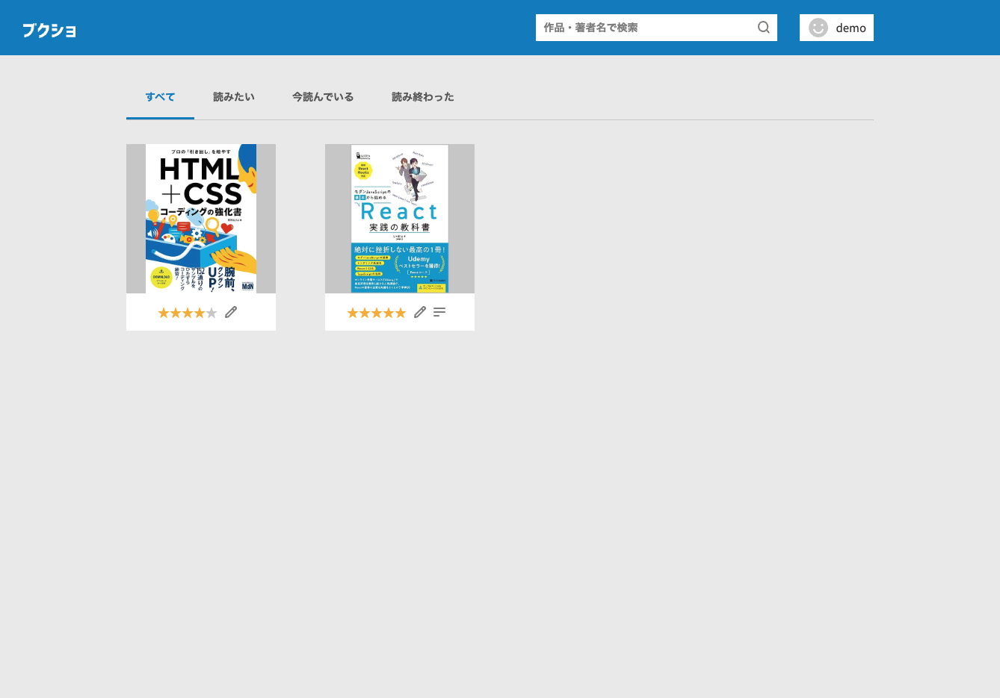
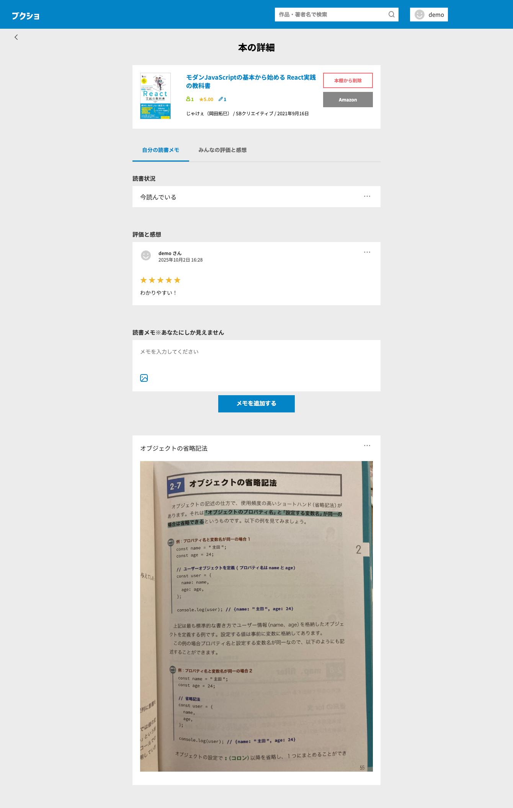
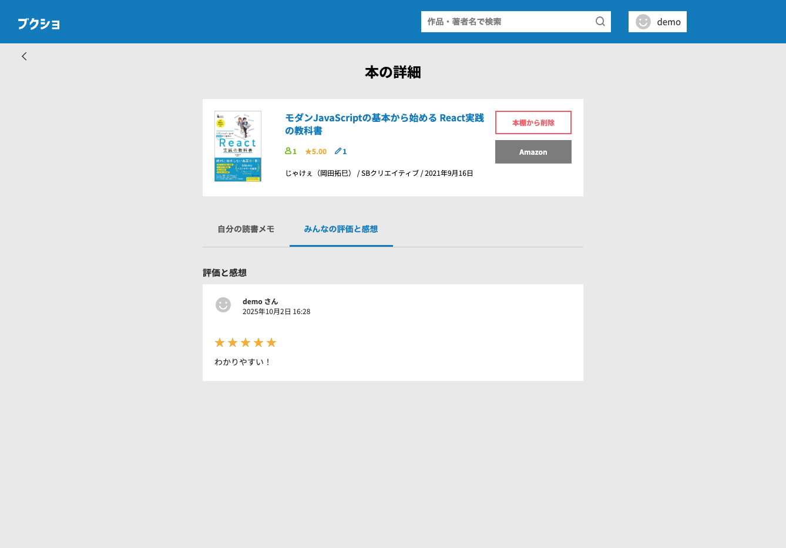

## プロジェクト概要

本のメモ・スクショ・レビューを管理できる本棚メモアプリです。
本で勉強する際に、後で見返そうと思ったページをスマホで写真を撮るのですが、その写真を後から見つけることができない問題を解決するために開発しました。
React・Node.js・Express・Prisma・Supabase を用いて構築し、ログイン機能や画像アップロード、メモ・レビュー投稿・検索機能を実装しました。

## 使用技術

**フロントエンド**: React, Vite, SCSS Modules  
**バックエンド**: Node.js, Express, Prisma  
**データベース**: PostgreSQL (Supabase)  
**認証**: JWT  
**ホスティング**: Vercel（フロント）, Render（バックエンド）  
**ストレージ**: Supabase Storage

## 主な機能

- ユーザー登録／ログイン（JWT 認証）
- 本の検索
- 本棚登録（読みたい/今読んでいる/読み終わった）
- メモ（画像付き）投稿機能
- レビュー・評価投稿

## デモ環境

- 本番 URL：https://book-memo-app-front.vercel.app
- テストログイン用アカウント：
  - ユーザー名: demo
  - パスワード: demo

## スクリーンショット

## ローカル開発手順

git clone https://github.com/mai/book-memo-app.git
cd book-memo-app-front
npm install
npm run dev
